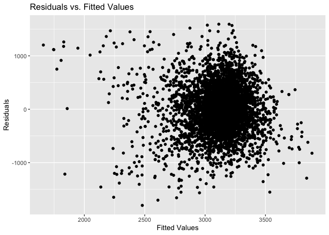
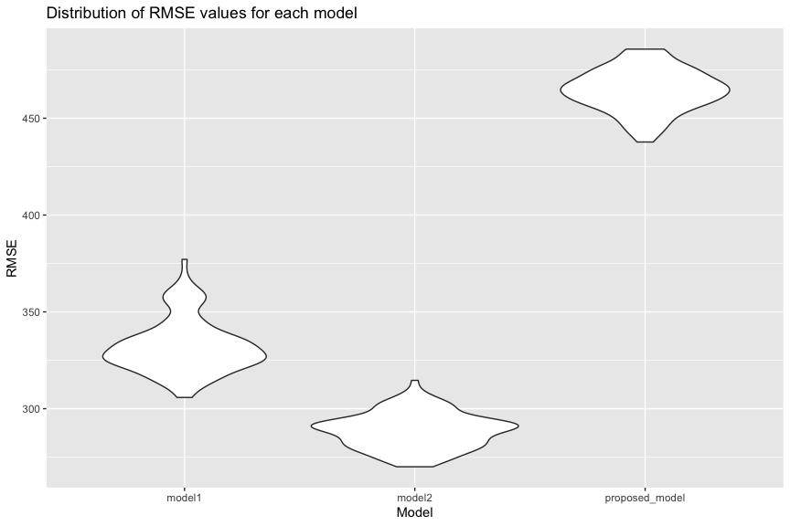
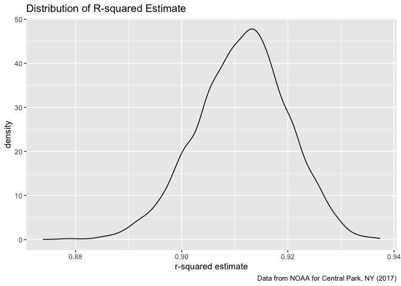
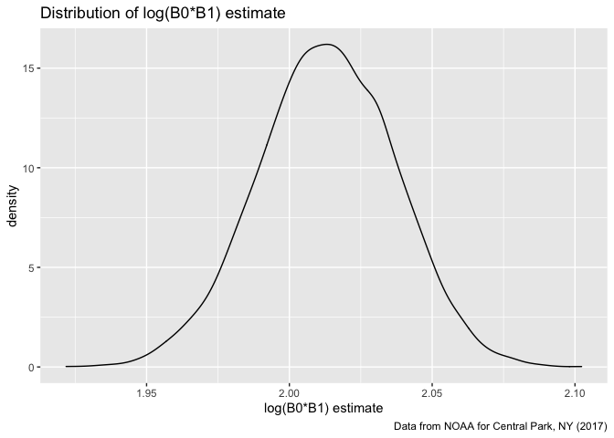

Homework 6
================
Linh Tran
11/29/2020

  - [Problem 1](#problem-1)
  - [Problem 2](#problem-2)
  - [Problem 3](#problem-3)

# Problem 1

Load dataset

``` r
homicide_df =
  read_csv("data/homicide-data.csv", na = c("", "NA", "Unknown")) %>% 
  mutate(
    city_state = str_c(city, state, sep = ", "),
    victim_age = as.numeric(victim_age),
    resolution = case_when(
      disposition == "Closed without arrest" ~ 0,
      disposition == "Open/No arrest"        ~ 0,
      disposition == "Closed by arrest"      ~ 1)
  ) %>% 
  filter(
    victim_race %in% c("White", "Black"),
    city_state != "Tulsa, AL") %>% 
  select(city_state, resolution, victim_age, victim_race, victim_sex)
```

    ## Parsed with column specification:
    ## cols(
    ##   uid = col_character(),
    ##   reported_date = col_double(),
    ##   victim_last = col_character(),
    ##   victim_first = col_character(),
    ##   victim_race = col_character(),
    ##   victim_age = col_double(),
    ##   victim_sex = col_character(),
    ##   city = col_character(),
    ##   state = col_character(),
    ##   lat = col_double(),
    ##   lon = col_double(),
    ##   disposition = col_character()
    ## )

Start with one city

``` r
baltimore_df =
  homicide_df %>% 
  filter(city_state == "Baltimore, MD")

glm(resolution ~ victim_age + victim_race + victim_sex, 
    data = baltimore_df,
    family = binomial()) %>%    #most of coefficient estimates are negative, meaning resolution becomes less likely in comparison to reference group. 
  broom::tidy() %>% 
  mutate(
    OR = exp(estimate),
    CI_lower = exp(estimate - 1.96 * std.error),
    CI_upper = exp(estimate + 1.96 * std.error)
  ) %>% 
  select(term, OR, starts_with("CI")) %>% 
  knitr::kable(digits = 3)
```

| term              |    OR | CI\_lower | CI\_upper |
| :---------------- | ----: | --------: | --------: |
| (Intercept)       | 1.363 |     0.975 |     1.907 |
| victim\_age       | 0.993 |     0.987 |     1.000 |
| victim\_raceWhite | 2.320 |     1.648 |     3.268 |
| victim\_sexMale   | 0.426 |     0.325 |     0.558 |

Try this across cities

``` r
models_results_df = 
  homicide_df %>% 
  nest(data = -city_state) %>% 
  mutate(
    models = 
      map(.x = data, ~glm(resolution ~ victim_age + victim_race + victim_sex, data = .x, family = binomial)),
    results = map(models, broom::tidy)
  ) %>% 
  select(city_state, results) %>% 
  unnest(results) %>% 
  mutate(
    OR = exp(estimate),
    CI_lower = exp(estimate - 1.96 * std.error),
    CI_upper = exp(estimate + 1.96 * std.error)
  ) %>% 
  select(city_state, term, OR, starts_with("CI"))
```

Make a plot comparing OR between male and female homicide victim along
with CI

``` r
models_results_df %>% 
  filter(term == "victim_sexMale") %>% 
  mutate(city_state = fct_reorder(city_state, OR)) %>% 
  ggplot(aes(x = city_state, y = OR)) +
  geom_point() +
  geom_errorbar(aes(ymin = CI_lower, ymax = CI_upper)) +
  theme(axis.text.x = element_text(angle = 90, hjust = 1))
```

<!-- -->

# Problem 2

Load and clean the data

``` r
baby_df = 
  read_csv("data/birthweight.csv") %>%
  mutate(
    babysex = as.factor(recode(babysex, `1` = "male", `2` = "female")),
    frace = as.factor(recode(frace, `1` = "White", `2` = "Black", `3` = "Asian", `4` = "Puerto Rican", `8` = "Other", `9` = "Unknown")),
    mrace = as.factor(recode(frace, `1` = "White", `2` = "Black", `3` = "Asian", `4` = "Puerto Rican", `8` = "Other")),
    malform = as.factor(recode(malform, `0` = "absent", `1` = "present"))
    )
```

    ## Parsed with column specification:
    ## cols(
    ##   .default = col_double()
    ## )

    ## See spec(...) for full column specifications.

Check for missing values:

``` r
baby_df %>% 
  drop_na()  #there is no missing values
```

    ## # A tibble: 4,342 x 20
    ##    babysex bhead blength   bwt delwt fincome frace gaweeks malform menarche
    ##    <fct>   <dbl>   <dbl> <dbl> <dbl>   <dbl> <fct>   <dbl> <fct>      <dbl>
    ##  1 female     34      51  3629   177      35 White    39.9 absent        13
    ##  2 male       34      48  3062   156      65 Black    25.9 absent        14
    ##  3 female     36      50  3345   148      85 White    39.9 absent        12
    ##  4 male       34      52  3062   157      55 White    40   absent        14
    ##  5 female     34      52  3374   156       5 White    41.6 absent        13
    ##  6 male       33      52  3374   129      55 White    40.7 absent        12
    ##  7 female     33      46  2523   126      96 Black    40.3 absent        14
    ##  8 female     33      49  2778   140       5 White    37.4 absent        12
    ##  9 male       36      52  3515   146      85 White    40.3 absent        11
    ## 10 male       33      50  3459   169      75 Black    40.7 absent        12
    ## # … with 4,332 more rows, and 10 more variables: mheight <dbl>, momage <dbl>,
    ## #   mrace <fct>, parity <dbl>, pnumlbw <dbl>, pnumsga <dbl>, ppbmi <dbl>,
    ## #   ppwt <dbl>, smoken <dbl>, wtgain <dbl>

**Modeling process**

By looking through the variables and based on my own prediction, I want
to fit a model using family monthly income (`fincome`) and gestational
age (`gaweeks`) as predictors for baby’s birthweight. My hypothesis is
that the family income is positively associated with birthweight, given
higher income generally indicate lower stress on the mothers and higher
social economic status. Existing literature also has shown that
gestational age is positively associated with birthweight, with the
higher the gestational age the higher the birthweight. I am curious to
see how much of an impact these factors have on baby’s birthweight.

``` r
proposed_model = lm(bwt ~ gaweeks + fincome, data = baby_df)
summary(proposed_model)
```

    ## 
    ## Call:
    ## lm(formula = bwt ~ gaweeks + fincome, data = baby_df)
    ## 
    ## Residuals:
    ##      Min       1Q   Median       3Q      Max 
    ## -1799.87  -291.87     2.81   294.87  1592.52 
    ## 
    ## Coefficients:
    ##             Estimate Std. Error t value Pr(>|t|)    
    ## (Intercept) 455.1089    88.1926   5.160 2.57e-07 ***
    ## gaweeks      64.9823     2.2416  28.989  < 2e-16 ***
    ## fincome       2.2058     0.2722   8.103 6.92e-16 ***
    ## ---
    ## Signif. codes:  0 '***' 0.001 '**' 0.01 '*' 0.05 '.' 0.1 ' ' 1
    ## 
    ## Residual standard error: 463.2 on 4339 degrees of freedom
    ## Multiple R-squared:  0.1823, Adjusted R-squared:  0.1819 
    ## F-statistic: 483.6 on 2 and 4339 DF,  p-value: < 2.2e-16

**A plot of model residuals against fitted values**

``` r
baby_df %>% 
  add_predictions(proposed_model) %>% 
  add_residuals(proposed_model) %>% 
  ggplot(aes(x = pred, y = resid)) + 
  geom_point() + 
  labs(
    x = "Fitted Values",
    y  = "Residuals",
    title = "Residuals vs. Fitted Values"
  )
```

<!-- -->

Residuals are centered around 0, and mostly scatter between -1000 and
1000. Most points cluster around prediction of 3200, however, there are
some departure in prediction, as the predicted weight values get
smaller, the residual values get higher, which indicate my proposed
model don’t perform well for babies with lower weights.  

Two other models for comparison given in the prompt:

``` r
model1 = lm(bwt ~ blength + gaweeks, data = baby_df)

model2 = lm(bwt ~ bhead * blength * babysex, data = baby_df)
```

**Compare these three models using CV**

``` r
cv_df = 
  crossv_mc(baby_df, 100) %>% 
  mutate(
    train = map(train, as_tibble),
    test = map(test, as_tibble)
  )

cv_df = 
  cv_df %>% 
  mutate(
    model1  = map(train, ~lm(bwt ~ blength + gaweeks, data = .x)),
    model2  = map(train, ~lm(bwt ~ bhead * blength * babysex, data = .x)),
    proposed_model  = map(train, ~lm(bwt ~ gaweeks + fincome, data = .x))
    ) %>% 
  mutate(
    rmse_model1 = map2_dbl(model1, test, ~rmse(model = .x, data = .y)),
    rmse_model2 = map2_dbl(model2, test, ~rmse(model = .x, data = .y)),
    rmse_proposed_model = map2_dbl(proposed_model, test, ~rmse(model = .x, data = .y))
    )
```

The distribution of RMSE values for each model.

``` r
cv_df %>% 
  select(starts_with("rmse")) %>% 
  pivot_longer(
    everything(),
    names_to = "model",
    values_to = "rmse",
    names_prefix = "rmse_"
  ) %>% 
  mutate(model = fct_inorder(model)) %>% 
  ggplot(aes(x = model, y = rmse)) +
  geom_violin() +
  labs(
    x = "Model",
    y = "RMSE",
    title = "Distribution of RMSE values for each model"
  )
```

<!-- -->

The second comparison model with predictors head circumference, length,
sex and all their interactions has the overall lowest RMSE values. My
proposed model has the highest RMSE. Between these three models, I would
probably pick the second model.

# Problem 3

Download dataset and just focus on Central Park, NY data.

``` r
weather_df = 
  rnoaa::meteo_pull_monitors(
    c("USW00094728"),
    var = c("PRCP", "TMIN", "TMAX"), 
    date_min = "2017-01-01",
    date_max = "2017-12-31") %>%
  mutate(
    name = recode(id, USW00094728 = "CentralPark_NY"),
    tmin = tmin / 10,
    tmax = tmax / 10) %>%
  select(name, id, everything())
```

    ## Registered S3 method overwritten by 'hoardr':
    ##   method           from
    ##   print.cache_info httr

    ## using cached file: /Users/linhmaitran/Library/Caches/R/noaa_ghcnd/USW00094728.dly

    ## date created (size, mb): 2020-10-05 10:25:47 (7.522)

    ## file min/max dates: 1869-01-01 / 2020-10-31

Bootstrap 5000 samples

``` r
set.seed(1)

weather_boot_results =
  weather_df %>%
  bootstrap(5000, id = "strap_number") %>% 
  mutate(
    models = map(.x = strap, ~lm (tmax ~ tmin, data = .x)),
    results = map(models, broom::tidy),
    glance = map(models, broom::glance)
  ) %>% 
  unnest(results, glance) %>% 
  select(strap_number, term, estimate, r.squared) %>% 
  pivot_wider(
    names_from = "term",
    values_from = "estimate"
  ) %>% 
  rename(intercept = "(Intercept)") %>% 
  mutate(log_est = log(intercept * tmin))
```

    ## Warning: unnest() has a new interface. See ?unnest for details.
    ## Try `df %>% unnest(c(results, glance))`, with `mutate()` if needed

Distribution of R-squared and log(B0\*B1) estimates

``` r
weather_boot_results %>% 
  ggplot(aes(x = r.squared)) +
  geom_density() +
  labs(
    x = "r-squared estimate",
    title = "Distribution of R-squared Estimate",
    caption = "Data from NOAA for Central Park, NY (2017)"
  )
```

<!-- -->

``` r
weather_boot_results %>% 
  ggplot(aes(x = log_est)) + 
  geom_density() +
  labs(
    x = "log(B0*B1) estimate",
    title = "Distribution of log(B0*B1) estimate",
    caption = "Data from NOAA for Central Park, NY (2017)"
  )
```

<!-- -->

Overall both distributions seem fairly normal. However, the distribution
of r-squared is slightly left-skewed with peak around 0.913. The
distribution of log (B0\*B1) has a peak of approximately 2.013.  

95% CI for R-squared and log(B0\*B1) estimates

``` r
set.seed(1)

weather_boot_results %>% 
  select(-intercept, -tmin) %>% 
  pivot_longer(
  r.squared:log_est,
  names_to = "term",
  values_to = "estimate"
  ) %>% 
  group_by(term) %>% 
  summarize(
    ci_lower = quantile(estimate, 0.025),
    ci_upper = quantile(estimate, 0.975)
  ) %>% 
  knitr::kable()
```

    ## `summarise()` ungrouping output (override with `.groups` argument)

| term      | ci\_lower | ci\_upper |
| :-------- | --------: | --------: |
| log\_est  | 1.9649487 |  2.058887 |
| r.squared | 0.8936684 |  0.927106 |

The 95% confidence interval for R squared is (0.893, 0.927) and for
log(B0\*B1) it is (1.965, 2.059).
