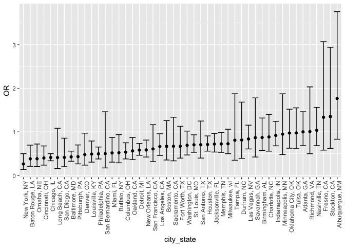
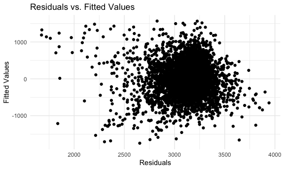
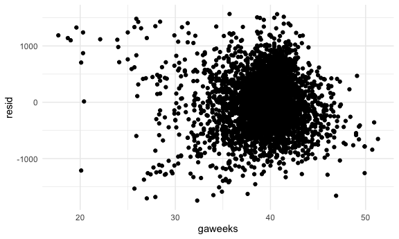
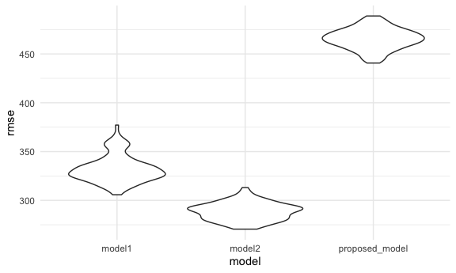

Homework 6
================
Linh Tran
11/29/2020

# Problem 1

Load dataset

``` r
homicide_df =
  read_csv("data/homicide-data.csv", na = c("", "NA", "Unknown")) %>% 
  mutate(
    city_state = str_c(city, state, sep = ", "),
    victim_age = as.numeric(victim_age),
    resolution = case_when(
      disposition == "Closed without arrest" ~ 0,
      disposition == "Open/No arrest"        ~ 0,
      disposition == "Closed by arrest"      ~ 1)
  ) %>% 
  filter(
    victim_race %in% c("White", "Black"),
    city_state != "Tulsa, AL") %>% 
  select(city_state, resolution, victim_age, victim_race, victim_sex)
```

    ## Parsed with column specification:
    ## cols(
    ##   uid = col_character(),
    ##   reported_date = col_double(),
    ##   victim_last = col_character(),
    ##   victim_first = col_character(),
    ##   victim_race = col_character(),
    ##   victim_age = col_double(),
    ##   victim_sex = col_character(),
    ##   city = col_character(),
    ##   state = col_character(),
    ##   lat = col_double(),
    ##   lon = col_double(),
    ##   disposition = col_character()
    ## )

Start with one city

``` r
baltimore_df =
  homicide_df %>% 
  filter(city_state == "Baltimore, MD")

glm(resolution ~ victim_age + victim_race + victim_sex, 
    data = baltimore_df,
    family = binomial()) %>%    #most of coefficient estimates are negative, meaning resolution becomes less likely in comparison to reference group. 
  broom::tidy() %>% 
  mutate(
    OR = exp(estimate),
    CI_lower = exp(estimate - 1.96 * std.error),
    CI_upper = exp(estimate + 1.96 * std.error)
  ) %>% 
  select(term, OR, starts_with("CI")) %>% 
  knitr::kable(digits = 3)
```

| term              |    OR | CI\_lower | CI\_upper |
| :---------------- | ----: | --------: | --------: |
| (Intercept)       | 1.363 |     0.975 |     1.907 |
| victim\_age       | 0.993 |     0.987 |     1.000 |
| victim\_raceWhite | 2.320 |     1.648 |     3.268 |
| victim\_sexMale   | 0.426 |     0.325 |     0.558 |

Try this across cities

``` r
models_results_df = 
  homicide_df %>% 
  nest(data = -city_state) %>% 
  mutate(
    models = 
      map(.x = data, ~glm(resolution ~ victim_age + victim_race + victim_sex, data = .x, family = binomial)),
    results = map(models, broom::tidy)
  ) %>% 
  select(city_state, results) %>% 
  unnest(results) %>% 
  mutate(
    OR = exp(estimate),
    CI_lower = exp(estimate - 1.96 * std.error),
    CI_upper = exp(estimate + 1.96 * std.error)
  ) %>% 
  select(city_state, term, OR, starts_with("CI"))
```

Make a plot comparing OR between male and female homicide victim along
with CI

``` r
models_results_df %>% 
  filter(term == "victim_sexMale") %>% 
  mutate(city_state = fct_reorder(city_state, OR)) %>% 
  ggplot(aes(x = city_state, y = OR)) +
  geom_point() +
  geom_errorbar(aes(ymin = CI_lower, ymax = CI_upper)) +
  theme(axis.text.x = element_text(angle = 90, hjust = 1))
```



# Problem 2

Load and clean the data

``` r
baby_df = 
  read_csv("data/birthweight.csv") %>%
  mutate(
    babysex = as.factor(recode(babysex, `1` = "male", `2` = "female")),
    frace = as.factor(recode(frace, `1` = "White", `2` = "Black", `3` = "Asian", `4` = "Puerto Rican", `8` = "Other", `9` = "Unknown")),
    mrace = as.factor(recode(frace, `1` = "White", `2` = "Black", `3` = "Asian", `4` = "Puerto Rican", `8` = "Other")),
    malform = as.factor(recode(malform, `0` = "absent", `1` = "present"))
    )
```

    ## Parsed with column specification:
    ## cols(
    ##   .default = col_double()
    ## )

    ## See spec(...) for full column specifications.

**Modeling process**

Proposed model

``` r
summary(lm(bwt ~ ., data = baby_df))  #babysex, bhead, blength, delwt, gaweeks, parity (*), smoken.
```

    ## 
    ## Call:
    ## lm(formula = bwt ~ ., data = baby_df)
    ## 
    ## Residuals:
    ##      Min       1Q   Median       3Q      Max 
    ## -1096.88  -185.28    -3.45   172.24  2347.81 
    ## 
    ## Coefficients: (7 not defined because of singularities)
    ##                     Estimate Std. Error t value Pr(>|t|)    
    ## (Intercept)       -6342.3515   659.7373  -9.613  < 2e-16 ***
    ## babysexmale         -28.5990     8.4718  -3.376 0.000743 ***
    ## bhead               130.6846     3.4534  37.842  < 2e-16 ***
    ## blength              75.0054     2.0231  37.074  < 2e-16 ***
    ## delwt                 4.1302     0.3951  10.455  < 2e-16 ***
    ## fincome               0.3071     0.1796   1.710 0.087346 .  
    ## fraceBlack          -80.9741    41.7014  -1.942 0.052231 .  
    ## fraceOther           19.4250    83.7314   0.232 0.816555    
    ## fracePuerto Rican   -48.2100    44.4466  -1.085 0.278128    
    ## fraceWhite           52.6086    41.3134   1.273 0.202944    
    ## gaweeks              11.5992     1.4667   7.908 3.29e-15 ***
    ## malformpresent        9.9691    70.6959   0.141 0.887865    
    ## menarche             -3.4617     2.8971  -1.195 0.232193    
    ## mheight              10.4318    10.3157   1.011 0.311950    
    ## momage                0.8249     1.2209   0.676 0.499320    
    ## mraceBlack                NA         NA      NA       NA    
    ## mraceOther                NA         NA      NA       NA    
    ## mracePuerto Rican         NA         NA      NA       NA    
    ## mraceWhite                NA         NA      NA       NA    
    ## parity               95.6069    40.5193   2.360 0.018342 *  
    ## pnumlbw                   NA         NA      NA       NA    
    ## pnumsga                   NA         NA      NA       NA    
    ## ppbmi                 5.1566    14.8999   0.346 0.729296    
    ## ppwt                 -3.6018     2.6139  -1.378 0.168289    
    ## smoken               -4.7618     0.5869  -8.114 6.33e-16 ***
    ## wtgain                    NA         NA      NA       NA    
    ## ---
    ## Signif. codes:  0 '***' 0.001 '**' 0.01 '*' 0.05 '.' 0.1 ' ' 1
    ## 
    ## Residual standard error: 272.7 on 4323 degrees of freedom
    ## Multiple R-squared:  0.7176, Adjusted R-squared:  0.7164 
    ## F-statistic: 610.2 on 18 and 4323 DF,  p-value: < 2.2e-16

``` r
proposed_model = lm(bwt ~ gaweeks + smoken, data = baby_df)
summary(proposed_model)
```

    ## 
    ## Call:
    ## lm(formula = bwt ~ gaweeks + smoken, data = baby_df)
    ## 
    ## Residuals:
    ##      Min       1Q   Median       3Q      Max 
    ## -1746.43  -289.47    -4.66   299.89  1567.65 
    ## 
    ## Coefficients:
    ##             Estimate Std. Error t value Pr(>|t|)    
    ## (Intercept) 480.9718    88.3822   5.442 5.56e-08 ***
    ## gaweeks      67.4530     2.2360  30.167  < 2e-16 ***
    ## smoken       -6.2691     0.9522  -6.584 5.13e-11 ***
    ## ---
    ## Signif. codes:  0 '***' 0.001 '**' 0.01 '*' 0.05 '.' 0.1 ' ' 1
    ## 
    ## Residual standard error: 464.4 on 4339 degrees of freedom
    ## Multiple R-squared:  0.1781, Adjusted R-squared:  0.1777 
    ## F-statistic: 470.1 on 2 and 4339 DF,  p-value: < 2.2e-16

**A plot of model residuals against fitted values**

``` r
baby_df %>% 
  modelr::add_residuals(proposed_model) %>% 
  ggplot(aes(x = resid)) +
  geom_density()
```



``` r
baby_df %>% 
  modelr::add_residuals(proposed_model) %>% 
  ggplot(aes(x = gaweeks, y = resid)) +
  geom_point() 
```



Two other models for comparison:

``` r
model1 = lm(bwt ~ blength + gaweeks, data = baby_df)
summary(model1)
```

    ## 
    ## Call:
    ## lm(formula = bwt ~ blength + gaweeks, data = baby_df)
    ## 
    ## Residuals:
    ##     Min      1Q  Median      3Q     Max 
    ## -1709.6  -215.4   -11.4   208.2  4188.8 
    ## 
    ## Coefficients:
    ##              Estimate Std. Error t value Pr(>|t|)    
    ## (Intercept) -4347.667     97.958  -44.38   <2e-16 ***
    ## blength       128.556      1.990   64.60   <2e-16 ***
    ## gaweeks        27.047      1.718   15.74   <2e-16 ***
    ## ---
    ## Signif. codes:  0 '***' 0.001 '**' 0.01 '*' 0.05 '.' 0.1 ' ' 1
    ## 
    ## Residual standard error: 333.2 on 4339 degrees of freedom
    ## Multiple R-squared:  0.5769, Adjusted R-squared:  0.5767 
    ## F-statistic:  2958 on 2 and 4339 DF,  p-value: < 2.2e-16

``` r
model2 = lm(bwt ~ bhead * blength * babysex, data = baby_df)
summary(model2)
```

    ## 
    ## Call:
    ## lm(formula = bwt ~ bhead * blength * babysex, data = baby_df)
    ## 
    ## Residuals:
    ##      Min       1Q   Median       3Q      Max 
    ## -1132.99  -190.42   -10.33   178.63  2617.96 
    ## 
    ## Coefficients:
    ##                             Estimate Std. Error t value Pr(>|t|)    
    ## (Intercept)                -801.9487  1102.3077  -0.728 0.466948    
    ## bhead                       -16.5975    34.0916  -0.487 0.626388    
    ## blength                     -21.6460    23.3720  -0.926 0.354421    
    ## babysexmale               -6374.8684  1677.7669  -3.800 0.000147 ***
    ## bhead:blength                 3.3244     0.7126   4.666 3.17e-06 ***
    ## bhead:babysexmale           198.3932    51.0917   3.883 0.000105 ***
    ## blength:babysexmale         123.7729    35.1185   3.524 0.000429 ***
    ## bhead:blength:babysexmale    -3.8781     1.0566  -3.670 0.000245 ***
    ## ---
    ## Signif. codes:  0 '***' 0.001 '**' 0.01 '*' 0.05 '.' 0.1 ' ' 1
    ## 
    ## Residual standard error: 287.7 on 4334 degrees of freedom
    ## Multiple R-squared:  0.6849, Adjusted R-squared:  0.6844 
    ## F-statistic:  1346 on 7 and 4334 DF,  p-value: < 2.2e-16

**Cross-validated predicted error**

``` r
cv_df = 
  crossv_mc(baby_df, 100) %>% 
  mutate(
    train = map(train, as_tibble),
    test = map(test, as_tibble)
  )

cv_df = 
  cv_df %>% 
  mutate(
    model1  = map(train, ~lm(bwt ~ blength + gaweeks, data = .x)),
    model2  = map(train, ~lm(bwt ~ bhead + blength + babysex, data = .x)),
    proposed_model  = map(train, ~lm(bwt ~ gaweeks + smoken, data = .x))
    ) %>% 
  mutate(
    rmse_model1 = map2_dbl(model1, test, ~rmse(model = .x, data = .y)),
    rmse_model2 = map2_dbl(model2, test, ~rmse(model = .x, data = .y)),
    rmse_proposed_model = map2_dbl(proposed_model, test, ~rmse(model = .x, data = .y))
    )
```

The distribution of RMSE values for each model.

``` r
cv_df %>% 
  select(starts_with("rmse")) %>% 
  pivot_longer(
    everything(),
    names_to = "model",
    values_to = "rmse",
    names_prefix = "rmse_"
  ) %>% 
  ggplot(aes(x = model, y = rmse)) +
  geom_violin()
```



# Problem 3

Download dataset and just focus on Central Park, NY data.

use bootstraps to obtain distribution for parameters interested in. Fit
a linear model of tmax and tmin. Proporiton of r squared value
(broom::glance) and log of (bo + b1) (broom::tidy)
