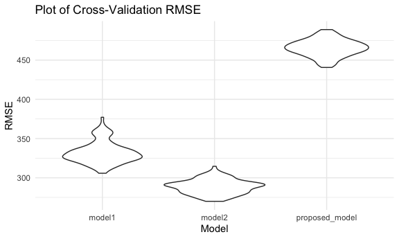

Homework 6
================
Linh Tran
11/29/2020

# Problem 1

Load dataset

``` r
homicide_df =
  read_csv("data/homicide-data.csv", na = c("", "NA", "Unknown")) %>% 
  mutate(
    city_state = str_c(city, state, sep = ", "),
    victim_age = as.numeric(victim_age),
    resolution = case_when(
      disposition == "Closed without arrest" ~ 0,
      disposition == "Open/No arrest"        ~ 0,
      disposition == "Closed by arrest"      ~ 1)
  ) %>% 
  filter(
    victim_race %in% c("White", "Black"),
    city_state != "Tulsa, AL") %>% 
  select(city_state, resolution, victim_age, victim_race, victim_sex)
```

    ## Parsed with column specification:
    ## cols(
    ##   uid = col_character(),
    ##   reported_date = col_double(),
    ##   victim_last = col_character(),
    ##   victim_first = col_character(),
    ##   victim_race = col_character(),
    ##   victim_age = col_double(),
    ##   victim_sex = col_character(),
    ##   city = col_character(),
    ##   state = col_character(),
    ##   lat = col_double(),
    ##   lon = col_double(),
    ##   disposition = col_character()
    ## )

Start with one city

``` r
baltimore_df =
  homicide_df %>% 
  filter(city_state == "Baltimore, MD")

glm(resolution ~ victim_age + victim_race + victim_sex, 
    data = baltimore_df,
    family = binomial()) %>%    #most of coefficient estimates are negative, meaning resolution becomes less likely in comparison to reference group. 
  broom::tidy() %>% 
  mutate(
    OR = exp(estimate),
    CI_lower = exp(estimate - 1.96 * std.error),
    CI_upper = exp(estimate + 1.96 * std.error)
  ) %>% 
  select(term, OR, starts_with("CI")) %>% 
  knitr::kable(digits = 3)
```

| term              |    OR | CI\_lower | CI\_upper |
| :---------------- | ----: | --------: | --------: |
| (Intercept)       | 1.363 |     0.975 |     1.907 |
| victim\_age       | 0.993 |     0.987 |     1.000 |
| victim\_raceWhite | 2.320 |     1.648 |     3.268 |
| victim\_sexMale   | 0.426 |     0.325 |     0.558 |

Try this across cities

``` r
models_results_df = 
  homicide_df %>% 
  nest(data = -city_state) %>% 
  mutate(
    models = 
      map(.x = data, ~glm(resolution ~ victim_age + victim_race + victim_sex, data = .x, family = binomial)),
    results = map(models, broom::tidy)
  ) %>% 
  select(city_state, results) %>% 
  unnest(results) %>% 
  mutate(
    OR = exp(estimate),
    CI_lower = exp(estimate - 1.96 * std.error),
    CI_upper = exp(estimate + 1.96 * std.error)
  ) %>% 
  select(city_state, term, OR, starts_with("CI"))
```

Make a plot comparing OR between male and female homicide victim along
with CI

``` r
models_results_df %>% 
  filter(term == "victim_sexMale") %>% 
  mutate(city_state = fct_reorder(city_state, OR)) %>% 
  ggplot(aes(x = city_state, y = OR)) +
  geom_point() +
  geom_errorbar(aes(ymin = CI_lower, ymax = CI_upper)) +
  theme(axis.text.x = element_text(angle = 90, hjust = 1))
```


# Problem 2

Load and clean the data

``` r
baby_df = 
  read_csv("data/birthweight.csv") %>%
  mutate(
    babysex = as.factor(recode(babysex, `1` = "male", `2` = "female")),
    frace = as.factor(recode(frace, `1` = "White", `2` = "Black", `3` = "Asian", `4` = "Puerto Rican", `8` = "Other", `9` = "Unknown")),
    mrace = as.factor(recode(frace, `1` = "White", `2` = "Black", `3` = "Asian", `4` = "Puerto Rican", `8` = "Other")),
    malform = as.factor(recode(malform, `0` = "absent", `1` = "present"))
    )
```

    ## Parsed with column specification:
    ## cols(
    ##   .default = col_double()
    ## )

    ## See spec(...) for full column specifications.

**Modeling process**

I run a linear regression for all the variables and found that the
gestational age in weeks (`gaweeks`) and average number of cigarettes
smoked per day during pregnancy (`smoken`) are significantly associated
with babies’ birthweights. So I am gonna fit a model using gestational
age and number of cigarettes smoked as predictors.

``` r
proposed_model = lm(bwt ~ gaweeks + smoken, data = baby_df)
summary(proposed_model)
```

    ## 
    ## Call:
    ## lm(formula = bwt ~ gaweeks + smoken, data = baby_df)
    ## 
    ## Residuals:
    ##      Min       1Q   Median       3Q      Max 
    ## -1746.43  -289.47    -4.66   299.89  1567.65 
    ## 
    ## Coefficients:
    ##             Estimate Std. Error t value Pr(>|t|)    
    ## (Intercept) 480.9718    88.3822   5.442 5.56e-08 ***
    ## gaweeks      67.4530     2.2360  30.167  < 2e-16 ***
    ## smoken       -6.2691     0.9522  -6.584 5.13e-11 ***
    ## ---
    ## Signif. codes:  0 '***' 0.001 '**' 0.01 '*' 0.05 '.' 0.1 ' ' 1
    ## 
    ## Residual standard error: 464.4 on 4339 degrees of freedom
    ## Multiple R-squared:  0.1781, Adjusted R-squared:  0.1777 
    ## F-statistic: 470.1 on 2 and 4339 DF,  p-value: < 2.2e-16

**A plot of model residuals against fitted values**

``` r
baby_df %>% 
  add_predictions(proposed_model) %>% 
  add_residuals(proposed_model) %>% 
  ggplot(aes(x = pred, y = resid)) + 
  geom_point() + 
  labs(
    x  = "Residuals",
    y = "Fitted Values",
    title = "Residuals vs. Fitted Values"
  )
```


Two other models for comparison given in the prompt:

``` r
model1 = lm(bwt ~ blength + gaweeks, data = baby_df)

model2 = lm(bwt ~ bhead * blength * babysex, data = baby_df)
```

**Cross-validated predicted error**

``` r
cv_df = 
  crossv_mc(baby_df, 100) %>% 
  mutate(
    train = map(train, as_tibble),
    test = map(test, as_tibble)
  )

cv_df = 
  cv_df %>% 
  mutate(
    model1  = map(train, ~lm(bwt ~ blength + gaweeks, data = .x)),
    model2  = map(train, ~lm(bwt ~ bhead * blength * babysex, data = .x)),
    proposed_model  = map(train, ~lm(bwt ~ gaweeks + smoken, data = .x))
    ) %>% 
  mutate(
    rmse_model1 = map2_dbl(model1, test, ~rmse(model = .x, data = .y)),
    rmse_model2 = map2_dbl(model2, test, ~rmse(model = .x, data = .y)),
    rmse_proposed_model = map2_dbl(proposed_model, test, ~rmse(model = .x, data = .y))
    )
```

The distribution of RMSE values for each model.

``` r
cv_df %>% 
  select(starts_with("rmse")) %>% 
  pivot_longer(
    everything(),
    names_to = "model",
    values_to = "rmse",
    names_prefix = "rmse_"
  ) %>% 
  mutate(model = fct_inorder(model)) %>% 
  ggplot(aes(x = model, y = rmse)) +
  geom_violin() +
  labs(
    x = "Model",
    y = "RMSE",
    title = "Plot of Cross-Validation RMSE"
  )
```



The second comparison model with predictors head circumference, length,
sex and all their interactions has the overall lowest RMSE values. My
proposed model has the highest RMSE. Between these three models, I would
probably pick the second model.

# Problem 3

Download dataset and just focus on Central Park, NY data.

``` r
weather_df = 
  rnoaa::meteo_pull_monitors(
    c("USW00094728"),
    var = c("PRCP", "TMIN", "TMAX"), 
    date_min = "2017-01-01",
    date_max = "2017-12-31") %>%
  mutate(
    name = recode(id, USW00094728 = "CentralPark_NY"),
    tmin = tmin / 10,
    tmax = tmax / 10) %>%
  select(name, id, everything())
```

    ## Registered S3 method overwritten by 'hoardr':
    ##   method           from
    ##   print.cache_info httr

    ## using cached file: /Users/linhmaitran/Library/Caches/R/noaa_ghcnd/USW00094728.dly

    ## date created (size, mb): 2020-10-05 10:25:47 (7.522)

    ## file min/max dates: 1869-01-01 / 2020-10-31

Bootstrap 5000 samples

``` r
set.seed(1)

weather_boot_results =
  weather_df %>%
  bootstrap(5000, id = "strap_number") %>% 
  mutate(
    models = map(.x = strap, ~lm (tmax ~ tmin, data = .x)),
    results = map(models, broom::tidy),
    glance = map(models, broom::glance)
  ) %>% 
  unnest(results, glance) %>% 
  select(strap_number, term, estimate, r.squared) %>% 
  pivot_wider(
    names_from = "term",
    values_from = "estimate"
  ) %>% 
  rename(intercept = "(Intercept)") %>% 
  mutate(log_est = log(intercept * tmin))
```

    ## Warning: unnest() has a new interface. See ?unnest for details.
    ## Try `df %>% unnest(c(results, glance))`, with `mutate()` if needed

**Distribution of \({\hat{r}}^2\)**

``` r
weather_boot_results %>% 
  ggplot(aes(x = r.squared)) +
  geom_density() +
  labs(
    x = "R-squared Estimate",
    title = "Distribution of R-squared Estimate"
  )
```


The distribution of r-squared is slightly left-skewed.  

Distribution of \(log(\widehat{\beta_o}\ *\ \widehat{\beta_1})\ \)

``` r
weather_boot_results %>% 
  ggplot(aes(x = log_est)) + 
  geom_density() 
```


95% CI for \({\hat{r}}^2\) and
\(log(\widehat{\beta_o}\ *\ \widehat{\beta_1})\ \)

``` r
set.seed(1)

weather_boot_results %>% 
  select(-intercept, -tmin) %>% 
  pivot_longer(
  r.squared:log_est,
  names_to = "term",
  values_to = "estimate"
  ) %>% 
  group_by(term) %>% 
  summarize(
    ci_lower = quantile(estimate, 0.025),
    ci_upper = quantile(estimate, 0.975)
  ) %>% 
  knitr::kable()
```

    ## `summarise()` ungrouping output (override with `.groups` argument)

| term      | ci\_lower | ci\_upper |
| :-------- | --------: | --------: |
| log\_est  | 1.9649487 |  2.058887 |
| r.squared | 0.8936684 |  0.927106 |

The 95% confidence interval for R squared is (0.893, 0.927) and for
log(B0\*B1) it is (1.965, 2.059).
